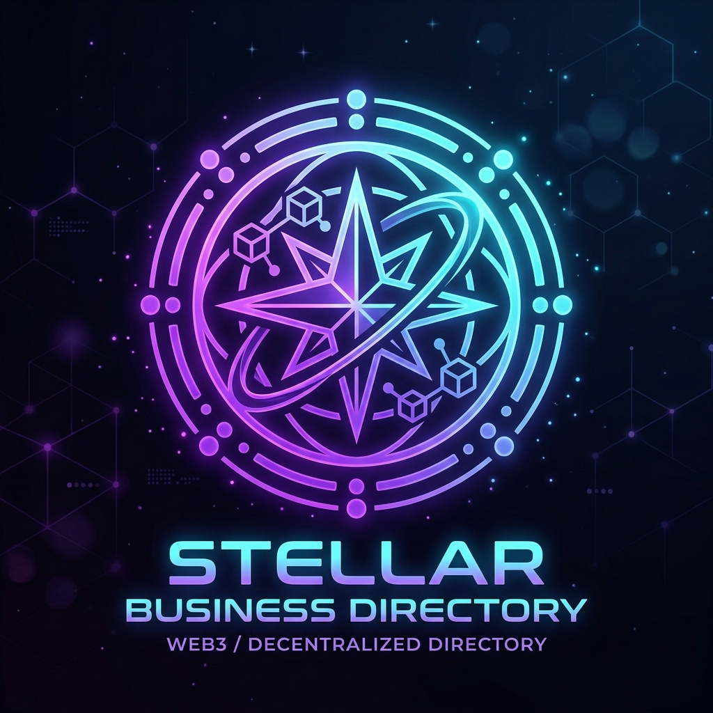
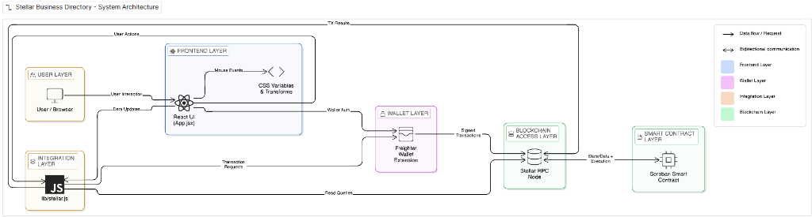
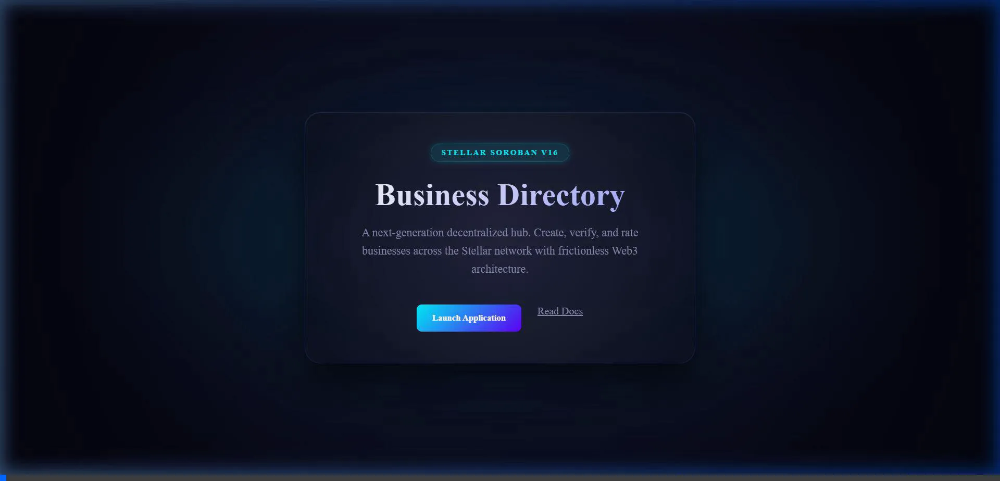
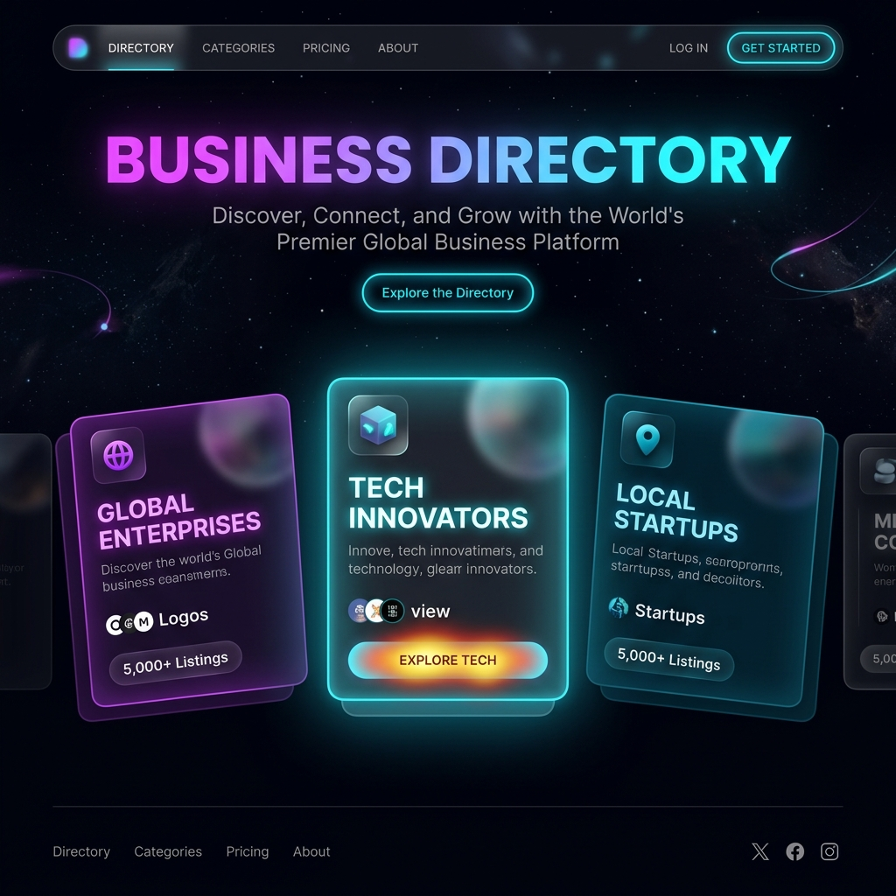

<div align="center">
  
  <h1>Stellar Business Directory (Soroban V16)</h1>
  <p><strong>A Next-Generation Decentralized On-Chain Utility</strong></p>
</div>

CONTRACT_ID = "CBRZQH6LCPYXSX6CRCJCSEZE7QFM2MXUDZMJVLQ2EEGYOM2JLGCHAJUX"

# 👋 Welcome to the Stellar Business Directory
🚀 Unleashing the power of Web3, this project leverages the **Stellar Soroban Smart Contract** network to maintain a global, immutable directory of businesses. It is built natively on decentralized principles rather than a traditional centralized data stack.

# 🧑‍💻 Tech Stack
- 🧑‍🎓 **Smart Contract Layer**: Deployed natively via Soroban for immutable CRUD and network state modifications.
- 🌱 **Integration Layer**: Utilizes `@stellar/stellar-sdk` and `@stellar/freighter-api` to orchestrate secure user signatures for all on-chain verification mechanisms.
- 💬 **Architectural Flow**: Designed to act as a direct, trustless peer-to-peer verification hub.
- 🚀 **Next-Gen Frontend**: A fully custom React 19 visual interface powered by Vite to display blockchain data streams.

# 🌐 Decentralized Features

### **1. On-Chain Deployment**
Interacting directly with Soroban smart contracts, users can deploy trustless profiles for newly verified businesses (Metadata, Location, Routing) and permanently anchor them onto the Stellar ledger.

### **2. Peer Consensus & Ratings**
Leveraging decentralized peer verification parameters, any connected node/wallet can function as a *Rater*. Trust mechanics and deactivation overrides are embedded straight into the contract logic.

### **3. Live Network Terminal**
To assist with blockchain transparency, the app features a built-in interactive JSON monitor styled like a classic hacker terminal payload system to live-stream blockchain transactions and node states.

---

### 🏗️ System Architecture Flow


---

### DApp UI Experience
Though fundamentally a Web3 architecture, the frontend boasts a deeply polished spatial-web environment to interface with the smart contracts using pure CSS, 3D native browser tilt logic, and mouse-tracked neon gradients!

**1. Live UI Recording (Hardware-Accelerated Tracking)**  


**2. Main Network Dashboard**  


---

# 🚀 Getting Started

### Prerequisites
- Node.js (matches `latest` stable build)
- [Freighter Wallet](https://www.freighter.app/) Browser Extension (Configured to Stellar Testnet)

### Initialization

1. **Clone the repository:**
   ```bash
   git clone https://github.com/pratyush06-aec/directory_listing.git
   cd my-stellar-app
   ```

2. **Install node dependencies:**
   ```bash
   npm install
   ```

3. **Ignite the Local Network:**
   ```bash
   npm run dev
   ```

To explore the dApp locally, boot up `http://localhost:5173`. Ensure your Freighter extension is connected and correctly pointed to the network!

---
<p align="center">
  <b>⭐ If you liked the project, please don't forget to give a star</b>
</p>
