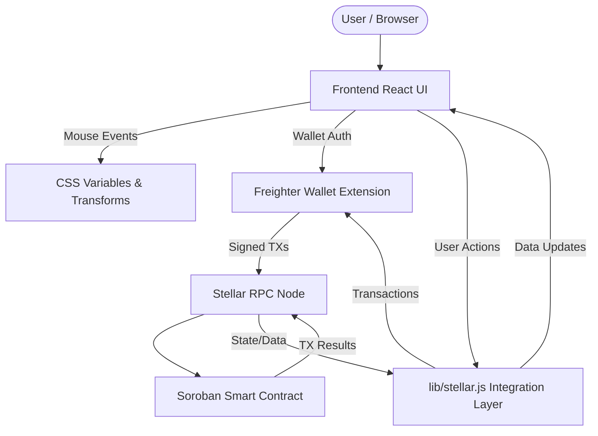

# Stellar Business Directory: System Architecture

This document describes the high-level architecture flow of the Stellar Business Directory application.

## 1. Frontend Layer (React + Vite)
- **App Shell (`App.jsx`)**: The core entry point that maintains the application state. It manages connection details, loading states, and the current interactive view (`landing` vs `app`).
- **UI Components & Glassmorphism (`App.css`)**: Pure CSS styling utilizing `--mouse-x` and `--mouse-y` runtime properties to handle 3D hardware-accelerated transforms and interactive heat-glow lighting without heavy external animation libraries.
- **State Management**: Uses React hooks (`useState`, `useEffect`, `useRef`) for local state. Actions that interact with the blockchain trigger a loading sequence and handle promise resolutions cleanly to update the UI "Terminal".

## 2. Integration Layer (`lib/stellar.js`)
- Interfaces between the React frontend and the Stellar Soroban Smart Contract side. 
- Handles Freighter wallet authentication and connection (`checkConnection`).
- Wraps all network calls into asynchronous functions (`createListing`, `updateListing`, `verifyListing`, etc.).

## 3. Blockchain Layer (Soroban / Stellar)
- **Smart Contract**: Handles the CRUD operations and immutable storage for the business directory on the Stellar network.
- **State Changes**: Methods for listing creation, updating fields, rating modifications, and deactivations.
- **Verification**: Built-in mechanisms (validators/raters) embedded in the contract state to keep listing data trustworthy.

## Architecture Flow Diagram

